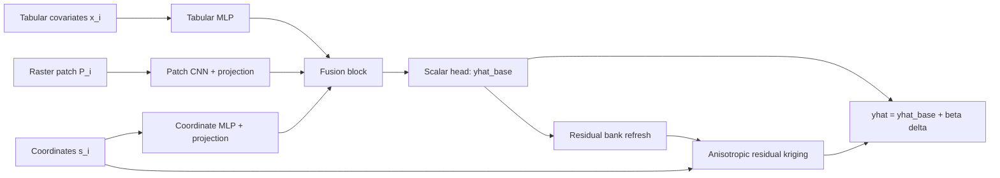

<div align="center">


# GeoVersa

### *Deep Learning + Geostatistics for Spatial Prediction*

[](https://doi.org/10.5281/zenodo.15139517)
[](https://cran.r-project.org/)
[](https://cran.r-project.org/)
[](https://torch.mlverse.org/)
[](LICENSE)
[](https://www.pedometrics.org/)
[](https://orcid.org/0000-0002-8070-8126)

[Overview](#overview) · [DeepSCORPAN](#from-scorpan-to-deepscorpan) · [Architecture](#active-architecture) · [Mathematics](#mathematical-formulation) · [Auto-Configuration](#automatic-configuration) · [Research-Family](#geoversa-research-family) · [Benchmark](#wadoux-reference-and-current-results) · [Usage](#how-to-run)

</div>

---

## Overview

**GeoVersa** is the research line behind a family of spatial prediction networks that combine deep representation learning with geostatistical residual correction.

The active, benchmarked path in this repository is the pure **ConvKrigingNet2D / GeoVersa** configuration:

- three encoders learn from tabular covariates, raster patches, and coordinates;
- a residual memory bank stores the current backbone residual field;
- a differentiable anisotropic kriging layer interpolates those residuals;
- a learned global gate controls how strongly the correction enters the final prediction;
- the training pipeline configures itself automatically from the fold, the variogram, and the available hardware.

The repository also preserves a broader GeoVersa research family of experimental architectures and benchmark histories. This `README` now does both:

- it documents the **current validated benchmark path exactly as the code executes it**;
- it keeps the **DeepSCORPAN / GeoVersa research narrative** and the references to your network families.

---

## From SCORPAN to DeepSCORPAN

Digital Soil Mapping is grounded in the **SCORPAN** framework:

```math
S(\mathbf{s}) = f(S, C, O, R, P, A, N) + \varepsilon(\mathbf{s})
```

where $S, C, O, R, P, A, N$ represent the classical soil-forming factors and $\varepsilon(\mathbf{s})$ is the spatially structured residual.

Classical regression-kriging keeps these two parts separate:

```math
\hat{S}(\mathbf{s}_0) =
\hat{f}(\mathbf{x}_0) +
\sum_{i=1}^{n} \lambda_i(\mathbf{s}_0)\,\hat{\varepsilon}(\mathbf{s}_i)
```

GeoVersa reframes that idea as a **DeepSCORPAN** program: the trend model and the residual geostatistical correction are learned inside one trainable system.

For the active GeoVersa benchmark path, the final standardized prediction is:

```math
\hat{y}_i^{(s)} =
\hat{y}_{i}^{\mathrm{base}} + \beta\,\delta_i
```

with:

- $\hat{y}_{i}^{\mathrm{base}}$: deep trend prediction;
- $\delta_i$: anisotropic residual interpolation from the memory bank;
- $\beta \in (0,1)$: learned global kriging gate.

This is the current concrete realization of the broader DeepSCORPAN idea in the repository.

### SCORPAN Mapping in GeoVersa

| SCORPAN factor | Current GeoVersa realization |
|---|---|
| $S, C, O, R, P, A$ | Tabular encoder over point-level covariates |
| $O, R$ as local landscape texture | 2D CNN patch encoder |
| $N$ | Coordinate encoder |
| $\varepsilon(\mathbf{s})$ | Differentiable anisotropic residual-kriging layer |

---

## Active Architecture

The benchmarked architecture has four coupled components:

| Component | Input | Output | Role |
|---|---|---|---|
| Tabular encoder | point covariates $\mathbf{x}_i$ | $\mathbf{e}_i^{\mathrm{tab}}$ | nonlinear trend from SCORPAN-style attributes |
| Patch encoder | raster patch $\mathbf{P}_i$ | $\mathbf{e}_i^{\mathrm{patch}}$ | local terrain and remote-sensing texture |
| Coordinate encoder | location $\mathbf{s}_i$ | $\mathbf{e}_i^{\mathrm{coord}}$ | smooth spatial trend component |
| Residual kriging layer | neighbor residual bank | $\delta_i$ | anisotropic spatial correction |



### Important implementation note

The active kriging layer is **purely spatial in its weighting rule**. It stores latent vectors in the bank for compatibility with the broader GeoVersa research program, but the current benchmarked path does **not** use latent similarity inside the kriging weights. That distinction matters and is reflected below in the mathematics.

---

## Mathematical Formulation

### Notation

| Symbol | Meaning |
|---|---|
| $\mathbf{x}_i \in \mathbb{R}^p$ | tabular covariates |
| $\mathbf{P}_i \in \mathbb{R}^{C \times H \times W}$ | raster patch |
| $\mathbf{s}_i \in \mathbb{R}^2$ | coordinates |
| `y_i` | observed target |
| `T(y_i)` | optional target transform |
| `y_i^{(s)}` | standardized training target |

The standardized target is:

```math
y_i^{(s)} = \frac{T(y_i) - \mu_y}{\sigma_y}
```

### Encoder Fusion

Each modality is encoded independently and projected into a shared latent space:

```math
\begin{aligned}
\mathbf{e}_i^{\mathrm{tab}}   &= f_{\mathrm{tab}}(\mathbf{x}_i), \\
\mathbf{e}_i^{\mathrm{patch}} &= W_{\mathrm{patch}}\,f_{\mathrm{cnn}}(\mathbf{P}_i), \\
\mathbf{e}_i^{\mathrm{coord}} &= W_{\mathrm{coord}}\,f_{\mathrm{coord}}(\mathbf{s}_i).
\end{aligned}
```

These embeddings are fused into a joint representation:

```math
\mathbf{z}_i =
f_{\mathrm{fuse}}
\left[
\mathbf{e}_i^{\mathrm{tab}},
\mathbf{e}_i^{\mathrm{patch}},
\mathbf{e}_i^{\mathrm{coord}}
\right]
```

and mapped to the base trend:

```math
\hat{y}_i^{\mathrm{base}} = h(\mathbf{z}_i)
```

### Residual Memory Bank

At each bank refresh, the current backbone defines residuals over the training set:

```math
r_j = y_j^{(s)} - \hat{y}_j^{\mathrm{base}}
```

so the memory bank can be written as:

```math
\mathcal{B} = \left\{ \left(\mathbf{z}_j, \mathbf{s}_j, r_j\right) \right\}_{j=1}^{n_{\mathrm{train}}}
```

### Anisotropic Residual Kriging

For query point $i$ and neighbor $j$, GeoVersa rotates coordinate offsets by a learned anisotropy angle $\theta$:

```math
\begin{aligned}
\Delta x_{ij} &= x_i - x_j, \\
\Delta y_{ij} &= y_i - y_j, \\
u_{ij} &= \cos(\theta)\,\Delta x_{ij} + \sin(\theta)\,\Delta y_{ij}, \\
v_{ij} &= -\sin(\theta)\,\Delta x_{ij} + \cos(\theta)\,\Delta y_{ij}.
\end{aligned}
```

The anisotropic distance is:

```math
d_{ij}^{\mathrm{aniso}} =
\sqrt{
\left(\frac{u_{ij}}{\ell_{\mathrm{maj}}}\right)^2 +
\left(\frac{v_{ij}}{\ell_{\mathrm{min}}}\right)^2 + \varepsilon
}
```

The active weighting rule is the exponential covariance softmax used in `AnisotropicExpCovKrigingLayer_Auto`:

```math
w_{ij} =
\frac{\exp\!\left(-3\,d_{ij}^{\mathrm{aniso}}\right)}
{\sum_{k \in \mathcal{N}(i)} \exp\!\left(-3\,d_{ik}^{\mathrm{aniso}}\right)}
```

and the residual correction is:

```math
\delta_i = \sum_{j \in \mathcal{N}(i)} w_{ij}\,r_j
```

This is intentionally different from earlier latent-attention variants explored in the GeoVersa research line. The benchmarked path described here uses **pure anisotropic spatial weighting**.

### Final Predictor

The global gate is learned end to end:

```math
\beta = \sigma(\mathrm{logit}_{\beta})
```

and the final standardized prediction is:

```math
\hat{y}_i^{(s)} = \hat{y}_i^{\mathrm{base}} + \beta\,\delta_i
```

### Training Objective

During warmup, only the backbone is optimized:

```math
\mathcal{L}_{\mathrm{warmup}} =
\mathrm{Huber}\!\left(y^{(s)}, \hat{y}^{\mathrm{base}}\right)
```

After warmup, the full model is trained with:

```math
\begin{aligned}
\mathcal{L}_{\mathrm{full}}
&=
\mathrm{Huber}\!\left(y^{(s)}, \hat{y}\right)
 + \lambda_{\mathrm{base}}\,
\mathrm{Huber}\!\left(y^{(s)}, \hat{y}^{\mathrm{base}}\right) \\
&\quad
 + \alpha_{\mathrm{ME}}
\left(
\mathrm{mean}\!\left(\hat{y}^{\mathrm{base}}\right) -
\mathrm{mean}\!\left(y^{(s)}\right)
\right)^2 \\
&\quad
 + \lambda_{\mathrm{cov}}
\left(
\frac{\mathrm{sd}\!\left(\hat{y}^{\mathrm{base}}\right)}
{\mathrm{sd}\!\left(y^{(s)}\right) + \varepsilon}
 - 1
\right)^2
\end{aligned}
```

For the current standalone GeoVersa benchmark:

- the model is trained only against the observed target;
- `r2` is reported as **Pearson squared** in the current benchmark path.

---

## Automatic Configuration

The active auto-config logic lives in `code/ConvKrigingNet2D_Auto_v5.R` and derives the model from the fold geometry, the fitted variogram, and device constraints.

### Variogram-Derived Spatial Initialization

From the empirical variogram, the code initializes:

- $\ell_{\mathrm{maj}}$, $\ell_{\mathrm{min}}$, and $\theta$;
- nugget-to-sill ratio $r$;
- neighborhood size $K$;
- the initial kriging gate prior.

The active rules are:

```math
\begin{aligned}
K &= \mathrm{clamp}
\left(
\mathrm{round}
\left(
\frac{n_{\mathrm{train}} \pi \,\mathrm{range}_{\mathrm{major}}^2}
{\mathrm{area}}
\right),
6, 30
\right), \\
\mathrm{logit}_{\beta,0} &= 2 - 6r.
\end{aligned}
```

### Capacity Rules

The latent widths and patch geometry follow:

```math
\begin{aligned}
d &=
\mathrm{clamp}
\left(
64 \left\lceil \frac{\sqrt{n_{\mathrm{train}}}}{8} \right\rceil,
128, 512
\right), \\
\mathrm{patch\_size} &=
\mathrm{clamp}
\left(
\left\lfloor \sqrt{n_{\mathrm{train}}} \right\rfloor,
8, 31
\right), \\
\mathrm{patch\_dim} &=
\mathrm{clamp}
\left(
\left\lceil \sqrt{C H W} \right\rceil,
\frac{d}{4}, d
\right), \\
\mathrm{coord\_dim} &=
\mathrm{clamp}
\left(
32 + 24(1 - \rho_{\mathrm{aniso}}) + 8(1-r),
32, 64
\right),
\end{aligned}
```

where:

```math
\rho_{\mathrm{aniso}} = \frac{\ell_{\mathrm{min}}}{\ell_{\mathrm{maj}}}
```

If patches are already cached, the actual cached tensor size overrides the heuristic `patch_size`.

### Loss Weights And Warmup

The current v5 rules are:

```math
\begin{aligned}
\lambda_{\mathrm{base}} &= \max(0.05,\; 0.10r), \\
\alpha_{\mathrm{ME}} &= 0.375r, \\
\lambda_{\mathrm{cov}} &= 0.025(1-r), \\
\mathrm{max\_warmup} &= \mathrm{clamp}\!\left(\mathrm{round}(4 + 16r), 4, 20\right).
\end{aligned}
```

The $0.05$ floor on $\lambda_{\mathrm{base}}$ is active because the standalone benchmark needs a minimum direct backbone signal in strongly spatial folds. Without that floor, the backbone under-learns.

### Optimization Rules

The initial learning rate is estimated with a Polyak-style probe:

```math
\alpha_{\mathrm{init}} =
\mathrm{clamp}
\left(
0.01 \frac{\mathcal{L}}{\lVert \nabla \mathcal{L} \rVert_2^2},
10^{-5},
10^{-3}
\right)
```

Weight decay scales with model size:

```math
\mathrm{wd} =
\mathrm{clamp}
\left(
\frac{10^{-3}}{\sqrt{(n_{\mathrm{params}}/10^6)/5}},
10^{-4},
10^{-2}
\right)
```

Batch size is chosen from the smaller of:

- a statistical target near $n_{\mathrm{train}} / 8$;
- a device-aware memory estimate.

After warmup, the code adapts:

- `patience`;
- `lr_patience`;
- `lr_decay`;
- `bank_refresh_every`.

---

## GeoVersa Research Family

The repository is not only the current ConvKrigingNet2D benchmark. It also records a broader family of GeoVersa research directions through archived searches, confirmations, and benchmark folders under `results/`.

### Benchmarked Core

- `PointPatch`
- `ConvKrigingNet2D`
- `GeoVersa`

### Functional And Basis-Oriented Families

- `GeoBasisMLP`
- `GeoImplicitNet`
- `GeoSplineNet`
- `GeoMonotoneSpline`
- `GeoNAMKrigingNet`
- `GeoMLSKrigingNet`

### Attention, Memory, And Set-Based Families

- `GeoHashKrigingNet`
- `GeoKernelAttentionKrigingNet`
- `GeoPrototypeKrigingNet`
- `GeoSetKrigingNet`
- `GeoSetLocalKrigingNet`
- `GeoNeuralProcessKrigingNet`
- `GeoTransformerKrigingNet`

### Structured Expert And Hybrid Families

- `GeoFlowKrigingNet`
- `GeoGraphKrigingNet`
- `GeoHyperKrigingNet`
- `GeoKANKrigingNet`
- `GeoMOEKrigingNet`
- `GeoSoftTreeKrigingNet`
- `PedoformerKrigingNet`

### Explicit Spatial-Structure Families

- `GeoVariogramKrigingNet`
- `GeoWaveletKrigingNet`
- `GeoScoreKrigingNet`

These families should be understood as part of the GeoVersa research program. The current benchmarked and documented production path, however, is the pure `ConvKrigingNet2D / GeoVersa` route described in this `README`.

---

## Wadoux Reference And Current Results

The repository now keeps two separate comparison tracks:

### 1. GeoVersa Benchmark

`code/run_wadoux_style_rf_conv_comparison.R`

This runs GeoVersa itself on Wadoux-style validation splits.

### 2. Wadoux RF Reference Reproduction

`code/run_wadoux_rf_reference.R`

This reproduces the Random Forest reference under the same validation framework.

Tracked upstream reference:

- repository: `AlexandreWadoux/SpatialValidation`;
- mirrored commit: `ba3ad39bfa8474a09e8ac4cd82a0161649648794`;
- local documentation: `docs/wadoux2021-reference/`.

### Current clean comparison

Setup:

- scenario: `random`;
- protocol: `DesignBased`;
- sample size: `500`;
- repetitions: `3`;
- model profile: `auto`;
- device: `mps`;
- metric convention: `Pearson^2`.

| Model | ME | RMSE | Pearson^2 | MEC |
|---|---:|---:|---:|---:|
| RF benchmark | 0.187 | 32.313 | 0.883 | 0.877 |
| GeoVersa, standalone auto | 0.403 | 33.033 | 0.873 | 0.870 |

Current reading:

- this is the current clean benchmark for the standalone `auto` path in this repository;
- GeoVersa is now being evaluated without any RF-guided training path;
- GeoVersa still does not yet beat the RF benchmark on `DesignBased`.

The current clean gap relative to the RF benchmark is:

```math
\Delta \mathrm{RMSE} = +0.720,
\qquad
\Delta \mathrm{Pearson}^2 = -0.010,
\qquad
\Delta \mathrm{MEC} = -0.007
```

The original saved Wadoux `.Rdata` outputs are still not present in the mirrored upstream checkout. Their availability is tracked in `docs/wadoux2021-reference/official_rdata_manifest.csv`.

---

## How To Run

### GeoVersa benchmark

```r
Sys.setenv(
  WADOUX_AUTO_V5_SCRIPT = normalizePath(file.path(getwd(), "code", "ConvKrigingNet2D_Auto_v5.R"), mustWork = FALSE),
  WADOUX_AUTO_SCRIPT    = normalizePath(file.path(getwd(), "code", "ConvKrigingNet2D_Auto.R"), mustWork = FALSE),
  WADOUX_MODELS         = "ConvKrigingNet2D",
  WADOUX_PROTOCOLS      = "DesignBased",
  WADOUX_N_ITER         = "10",
  WADOUX_SAMPLE_SIZE    = "500",
  WADOUX_MODEL_PROFILE  = "auto",
  WADOUX_DEVICE         = "mps",
  WADOUX_RESULTS_DIR    = "results/geoversa_run"
)

source("code/run_wadoux_style_rf_conv_comparison.R")
```

Useful override knobs exposed by the runner:

- `WADOUX_BASE_LOSS_WEIGHT`
- `WADOUX_K_NEIGHBORS`
- `WADOUX_WEIGHT_DECAY`
- `WADOUX_LR`
- `WADOUX_BATCH_SIZE`
- `WADOUX_PATIENCE`
- `WADOUX_LR_PATIENCE`
- `WADOUX_LR_DECAY`
- `WADOUX_ALPHA_ME`
- `WADOUX_LAMBDA_COV`
- `WADOUX_COORD_DROPOUT`

### Wadoux RF reference reproduction

```r
Sys.setenv(
  WADOUX_RF_SCENARIO    = "random",
  WADOUX_RF_PROTOCOLS   = "Population,DesignBased",
  WADOUX_RF_N_ITER      = "10",
  WADOUX_RF_SAMPLE_SIZE = "500",
  WADOUX_R2_METHOD      = "pearson",
  WADOUX_RF_RESULTS_DIR = "results/wadoux_rf_reference"
)

source("code/run_wadoux_rf_reference.R")
```

### Import official Wadoux `.Rdata` outputs

```r
source("code/import_wadoux_official_rdata.R")
```

---

## Repository Layout

```text
code/
  ConvKrigingNet2D_Auto.R
  ConvKrigingNet2D_Auto_v5.R
  run_wadoux_style_rf_conv_comparison.R
  run_wadoux_rf_reference.R
  import_wadoux_official_rdata.R
  wadoux2021_rf_reproduction_helpers.R

docs/
  wadoux2021-reference/

logo/
  GeoVersa Logo.png

results/
  geoversa_blw_confirm10_20260406/
  wadoux2021_rf_reference_random_designbased_10iter_pearson_20260405/
  many archived GeoVersa family searches and confirmations
```

---

## Citation

```bibtex
@software{GeoVersa,
  author = {Rodrigues, Hugo},
  title  = {{GeoVersa}: Deep Learning + Geostatistics for Spatial Prediction},
  year   = {2026},
  doi    = {10.5281/zenodo.15139517},
  url    = {https://github.com/HugoMachadoRodrigues/GeoVersa}
}
```

## References

- McBratney, A. B., Mendonça Santos, M. L., and Minasny, B. (2003). On digital soil mapping. *Geoderma*, 117(1-2), 3-52.
- Jenny, H. (1941). *Factors of Soil Formation: A System of Quantitative Pedology*.
- Wadoux, A. M. J.-C., Heuvelink, G. B. M., de Bruin, S., and Brus, D. J. (2021). Spatial cross-validation is not the right way to evaluate map accuracy. *Ecological Modelling*, 457, 109692. [https://doi.org/10.1016/j.ecolmodel.2021.109692](https://doi.org/10.1016/j.ecolmodel.2021.109692)
