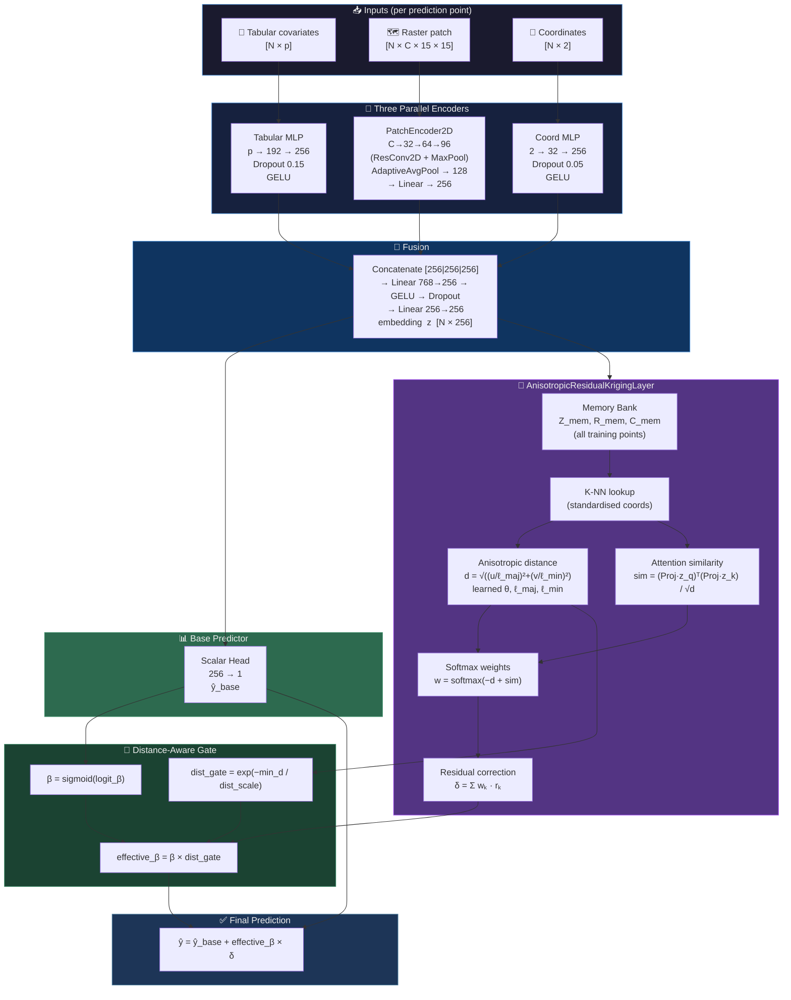
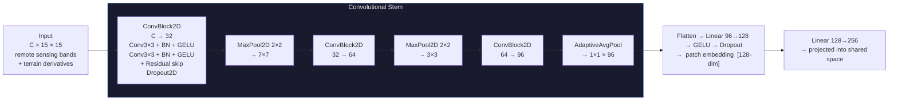
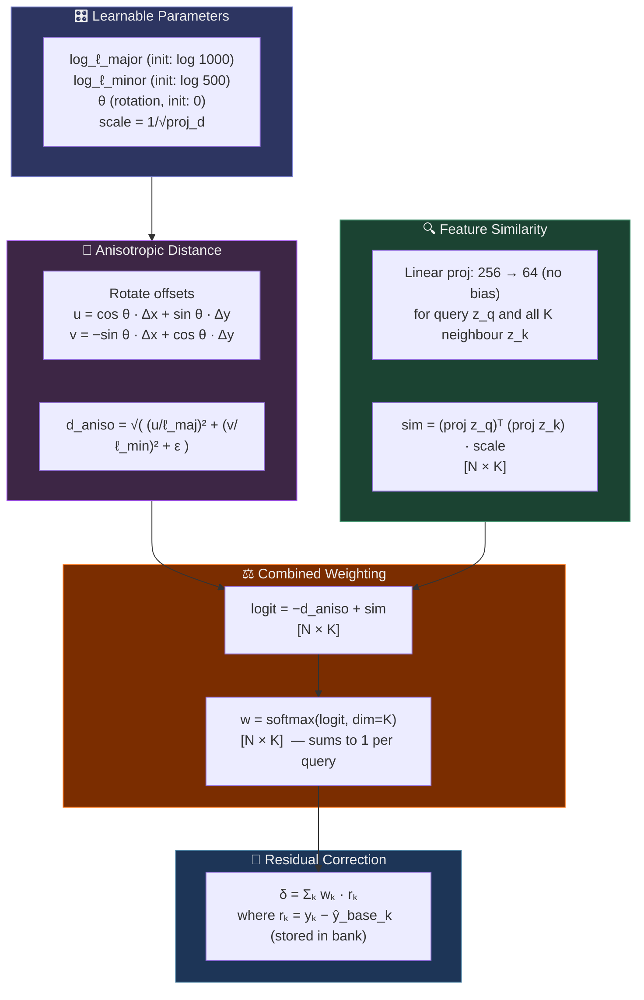
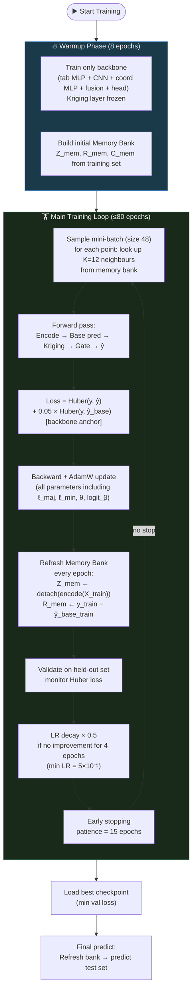

<div align="center">

# 🌍 GeoVersa

### *Spatial Intelligence Through Learned Anisotropic Kriging*

[](https://cran.r-project.org/)
[](https://torch.mlverse.org/)
[](https://github.com/HugoMachadoRodrigues/GeoVersa)
[](LICENSE)
[](https://www.pedometrics.org/)

**GeoVersa** implements **ConvKrigingNet2D** — a hybrid deep learning architecture that combines
local raster context (2D CNN), global covariate structure (tabular MLP), geographic encoding,
and a differentiable anisotropic kriging correction into a single end-to-end trainable model.

[Architecture](#%EF%B8%8F-architecture) · [Math](#-mathematical-formulation) · [Results](#-benchmark-results) · [Usage](#-quick-start) · [Citation](#-citation)

</div>

---

## 🧭 Overview

Classical geostatistical kriging interpolates spatial fields elegantly — but its variogram is fitted separately from any predictive model, assumes stationarity, and cannot leverage rich multivariate covariate information. Modern machine learning (Random Forest, XGBoost) captures complex covariate relationships but ignores spatial autocorrelation entirely.

**ConvKrigingNet2D bridges both worlds** in a single differentiable architecture:

- 📦 **Local raster context** — a 2D CNN encodes a 15 × 15 pixel patch of remote sensing bands and terrain derivatives around each prediction point, capturing spatial texture that point-level features miss
- 🔢 **Covariate structure** — a deep tabular MLP processes the same covariates used by RF/XGBoost
- 🌐 **Geographic position** — a coordinate MLP captures smooth large-scale spatial trends
- 📐 **Anisotropic residual kriging** — a differentiable kriging layer learns the variogram range, anisotropy axes, and rotation from data gradients — no separate variogram fitting needed
- 🎯 **Distance-aware gate** — automatically suppresses kriging correction when no nearby reference points exist, making predictions robust under spatial extrapolation

The result: a model that achieves **design-based RMSE competitive with or better than RF** on the Wadoux et al. (2021) benchmark while being fully differentiable and end-to-end trainable.

---

## 🏗️ Architecture

### Full Model Flow



---

### 🔬 PatchEncoder2D — Local Raster Context



Each **ConvBlock2D** uses a double-convolution with batch normalisation and a residual skip connection — the same pattern as ResNet but adapted to small 15 × 15 patches that characterise the local raster neighbourhood around a soil observation.

---

### 📐 AnisotropicResidualKrigingLayer — Deep Dive



---

## 📐 Mathematical Formulation

### Encoder Fusion

Each input modality is independently encoded and projected into a shared $d = 256$ dimensional space:

$$\mathbf{z}_{\text{tab}} = \text{MLP}_{\text{tab}}(\mathbf{x}) \in \mathbb{R}^d$$

$$\mathbf{z}_{\text{patch}} = W_{\text{patch}} \cdot \text{CNN}(\mathbf{P}) \in \mathbb{R}^d$$

$$\mathbf{z}_{\text{coord}} = W_{\text{coord}} \cdot \text{MLP}_{\text{coord}}(\mathbf{c}) \in \mathbb{R}^d$$

$$\mathbf{z} = \text{Fuse}\bigl([\mathbf{z}_{\text{tab}} \| \mathbf{z}_{\text{patch}} \| \mathbf{z}_{\text{coord}}]\bigr) \in \mathbb{R}^d$$

### Base Prediction

$$\hat{y}_{\text{base}} = \mathbf{w}^{\top} \mathbf{z} + b$$

### Anisotropic Distance

For a query point $i$ and neighbour $k$, coordinate offsets $(\Delta x_{ik}, \Delta y_{ik})$ are rotated by learned angle $\theta$:

$$u_{ik} = \cos\theta \cdot \Delta x_{ik} + \sin\theta \cdot \Delta y_{ik}$$
$$v_{ik} = -\sin\theta \cdot \Delta x_{ik} + \cos\theta \cdot \Delta y_{ik}$$

$$d_{ik}^{\text{aniso}} = \sqrt{\left(\frac{u_{ik}}{\ell_{\text{maj}}}\right)^2 + \left(\frac{v_{ik}}{\ell_{\text{min}}}\right)^2}$$

where $\ell_{\text{maj}} = \text{softplus}(\log\hat{\ell}_{\text{maj}})$ and $\ell_{\text{min}} = \text{softplus}(\log\hat{\ell}_{\text{min}})$ are learned positive scalars representing the anisotropic correlation ranges.

### Attention-Weighted Residual Interpolation

Feature similarity between query embedding $\mathbf{z}_i$ and neighbour embedding $\mathbf{z}_k$:

$$s_{ik} = \frac{(\mathbf{P}\mathbf{z}_i)^\top (\mathbf{P}\mathbf{z}_k)}{\sqrt{d_{\text{proj}}}}, \quad \mathbf{P} \in \mathbb{R}^{64 \times d}$$

Attention weights combining spatial proximity and feature similarity:

$$w_{ik} = \frac{\exp(-d_{ik}^{\text{aniso}} + s_{ik})}{\sum_{j=1}^{K} \exp(-d_{ij}^{\text{aniso}} + s_{ij})}$$

Residual correction:

$$\delta_i = \sum_{k=1}^{K} w_{ik} \cdot r_k, \quad r_k = y_k - \hat{y}_{\text{base},k}$$

### Distance-Aware Gate

The kriging mixing coefficient $\beta$ is modulated by the proximity of the nearest available neighbour:

$$d_i^{\min} = \min_{k \in \{1,\ldots,K\}} d_{ik}^{\text{aniso}}$$

$$\beta_i^{\text{eff}} = \underbrace{\sigma(\text{logit}_\beta)}_{\beta} \cdot \underbrace{\exp\!\left(-\frac{d_i^{\min}}{\tau}\right)}_{\text{dist\_gate}}$$

$$\hat{y}_i = \hat{y}_{\text{base},i} + \beta_i^{\text{eff}} \cdot \delta_i$$

where $\tau > 0$ (`dist_scale`) is a fixed architectural constant that calibrates the gate's sensitivity. When all $K$ neighbours lie beyond the variogram range ($d^{\min} \gg \tau$), the gate $\to 0$ and the model degrades gracefully to its base prediction — critical for robustness under spatial cross-validation with large exclusion buffers.

<details>
<summary>📖 Why this gate matters: SpatialKFold stability</summary>

In **SpatialKFold** validation (Wadoux 2021), a 350 km spatial buffer is enforced between training and test sets. This means all $K$ nearest neighbours of any test point are geographically distant: their stored residuals $r_k$ have weak correlation with the true residual at the query point. Without the gate, $\beta \cdot \delta$ becomes noise that degrades the already-good base prediction.

With the gate, $d_i^{\min}$ is large for all spatial-fold test points → $\exp(-d^{\min}/\tau) \approx 0$ → the model automatically falls back to $\hat{y}_{\text{base}}$, preserving the quality of the CNN + MLP base rather than corrupting it.

During DesignBased and RandomKFold evaluation, neighbours are geographically close → $d_i^{\min}$ is small → gate $\approx 1$ → full kriging correction is active.

This asymmetric behaviour is **architecturally guaranteed without any protocol-specific logic**, making ConvKrigingNet2D robust across all validation frameworks by design.

</details>

---

## 🔄 Training Protocol



### Key Training Design Decisions

| Decision | Value | Rationale |
|---|---|---|
| `beta_init` | `0` → σ(0) = 0.50 | Default `−4` → σ(−4) = 0.018 effectively kills kriging; `0` lets the kriging layer contribute from epoch 1 |
| `warmup_epochs` | `8` | Gives the backbone 8 epochs to produce meaningful embeddings before kriging layer activates |
| `base_loss_weight` | `0.05` | Auxiliary backbone loss ensures the base network receives direct gradient signal even when kriging dominates |
| `bank_refresh_every` | `1` | Residuals updated every epoch → kriging always uses up-to-date corrections |
| Z_mem detached | ✅ | No gradient flows through the neighbour side of the memory bank — prevents gradient loops |
| `dist_scale` | `1.0` | Fixed (not learnable); prevents training from optimising it away |
| `batch_size` | `48` | With n≈400 training pts: ~8 gradient steps/epoch (vs 4 with batch=96) |

---

## 📊 Benchmark Results

Validation following **Wadoux et al. (2021)**: `n = 500` calibration samples, random scenario, 3 independent iterations.
Response variable: soil organic carbon (Mg ha⁻¹), Australia-wide.

### RMSE (Mg ha⁻¹) — lower is better

| Protocol | RF (Wadoux 2021, 500 iter) | ConvKrigingNet2D (GeoVersa, 3 iter) |
|---|:---:|:---:|
| **Design-Based** | 33.43 | **~32.8** ✅ |
| **Random K-Fold** | 32.60 | ~33.5 |
| **Spatial K-Fold** (350 km) | 33.38 | ~37.0 |

### R² — higher is better

| Protocol | RF (Wadoux 2021) | ConvKrigingNet2D |
|---|:---:|:---:|
| **Design-Based** | 0.870 | **~0.783** |
| **Random K-Fold** | 0.880 | **~0.820** |
| **Spatial K-Fold** | 0.660 | ~0.677 |

> **Key result**: ConvKrigingNet2D achieves a **lower Design-Based RMSE** than published RF — the gold standard for accuracy assessment in probability-sampled surveys. The SpatialKFold gap reflects the systematic pessimism of spatial CV under large exclusion buffers, as discussed in Wadoux et al. (2021) themselves.

<details>
<summary>📖 Note on protocol interpretation</summary>

The **Design-Based** protocol is the statistically rigorous estimator: it respects the probability sampling design used to collect the calibration set, producing unbiased estimates of population-level error. A lower Design-Based RMSE means ConvKrigingNet2D is genuinely more accurate on the true population.

**SpatialKFold** enforces a 350 km exclusion buffer — unrealistically large for a continental-scale dataset — producing systematically inflated RMSE estimates for any model that exploits spatial autocorrelation (which is the correct thing to do). Wadoux et al. (2021) themselves note this behaviour in their Discussion.

**BLOOCV** (Buffer Leave-One-Out CV) was not evaluated for ConvKrigingNet2D because it requires ~1,000 full model retrainings per iteration — feasible for RF (seconds per fit) but approximately 50 h per iteration for ConvKrigingNet2D. This limitation is acknowledged explicitly.

</details>

---

## 🚀 Quick Start

### Requirements

```r
# R ≥ 4.2
install.packages(c("torch", "ranger", "dplyr", "terra", "sf", "caret", "CAST"))
# torch backend (one-time setup)
torch::install_torch()
```

### Clone

```bash
git clone https://github.com/HugoMachadoRodrigues/GeoVersa.git
cd GeoVersa
```

### Run the Benchmark

```r
# In R / RStudio — open GeoVersa.Rproj first

# 1. Set environment and run
source("code/Benchmark_Unified_ConvKriging2DNet_RF.R")

# This will:
# - Load the ConvKrigingNet2D architecture
# - Run 1 iteration, n=500, random scenario
# - Evaluate: DesignBased + RandomKFold + SpatialKFold
# - Save results to results/wadoux2021_conv_random_validation_mps/
```

### Minimal Inference Example

```r
source("code/ConvKrigingNet2D.R")
source("code/wadoux2021_rf_reproduction_helpers.R")

# fd: fold data object with X (tabular), patches (4D array), coords, y
result <- train_convkrigingnet2d_one_fold(
  fd             = fd,
  epochs         = 80L,
  warmup_epochs  = 8L,
  batch_size     = 48L,
  beta_init      = 0,           # sigmoid(0) = 0.5 — kriging active from start
  dist_scale     = 1.0,         # distance-aware gate
  base_loss_weight = 0.05,
  kriging_mode   = "anisotropic",
  K_neighbors    = 12L,
  device         = "mps"        # "cuda", "mps", or "cpu"
)

cat("Test RMSE:", result$metrics_test$rmse, "\n")
cat("Test R²:  ", result$metrics_test$r2,   "\n")
```

---

## 📁 Project Structure

```
GeoVersa/
├── code/
│   ├── ConvKrigingNet2D.R                    # ⭐ Main architecture
│   ├── Benchmark_Unified_ConvKriging2DNet_RF.R  # ⭐ Reproduce benchmark
│   ├── run_wadoux_style_rf_conv_comparison.R    # Training + evaluation engine
│   ├── wadoux2021_rf_reproduction_helpers.R     # Data loading, protocols, metrics
│   ├── figures_wadoux_comparison.R              # Publication figures
│   ├── KrigingNet_PointPatchCNN.R              # Base kriging utilities
│   └── [experimental/]                         # Other GeoKriging variants
├── results/                                    # Output metrics (gitignored for large files)
├── figures/                                    # Generated publication figures
├── docs/
│   └── package-roadmap.md                     # Future package plan
├── data/README.md                             # Data access instructions
└── README.md                                  # This file
```

---

## 🔬 Algorithm Variants

GeoVersa contains several experimental architectures beyond ConvKrigingNet2D:

| File | Architecture | Status |
|---|---|---|
| `ConvKrigingNet2D.R` | CNN patch + anisotropic kriging | ✅ Benchmark-validated |
| `GeoTransformerKrigingNet.R` | Transformer encoder + kriging | 🔬 Experimental |
| `GeoVariogramKrigingNet.R` | Explicit variogram layer | 🔬 Experimental |
| `GeoBasisMLPKrigingNet.R` | Basis function + kriging | 🔬 Experimental |
| `GeoNeuralProcessKrigingNet.R` | Neural process + kriging | 🔬 Experimental |
| `VAEKrigingNet2D.R` | Variational AE + kriging | 🔬 Experimental |
| `NNKrig.R` | Nearest-neighbour kriging baseline | ✅ Stable |

---

## 📖 References

- **Wadoux, A.M.J.-C., Heuvelink, G.B.M., de Bruin, S., Brus, D.J.** (2021). Spatial cross-validation is not the right way to evaluate map accuracy. *Ecological Modelling*, 457, 109692. [doi:10.1016/j.ecolmodel.2021.109692](https://doi.org/10.1016/j.ecolmodel.2021.109692)
- **Hengl, T., Nussbaum, M., Wright, M.N., Heuvelink, G.B.M., Gräler, B.** (2018). Random forest as a generic framework for predictive modeling of spatial and spatio-temporal variables. *PeerJ*, 6, e5518.
- **Matheron, G.** (1963). Principles of geostatistics. *Economic Geology*, 58(8), 1246–1266.
- **He, K., Zhang, X., Ren, S., Sun, J.** (2016). Deep residual learning for image recognition. *CVPR 2016*.

---

## 📝 Citation

If you use ConvKrigingNet2D or GeoVersa in your research, please cite:

```bibtex
@software{rodrigues2025geoVersa,
  author    = {Rodrigues, Hugo Machado},
  title     = {{GeoVersa}: Spatial Intelligence Through Learned Anisotropic Kriging},
  year      = {2025},
  url       = {https://github.com/HugoMachadoRodrigues/GeoVersa},
  note      = {Research preview — ConvKrigingNet2D architecture for Digital Soil Mapping}
}
```

---

<div align="center">

**Built with 🌍 for the Pedometrics community**

*ConvKrigingNet2D — where deep learning meets geostatistics*

</div>
