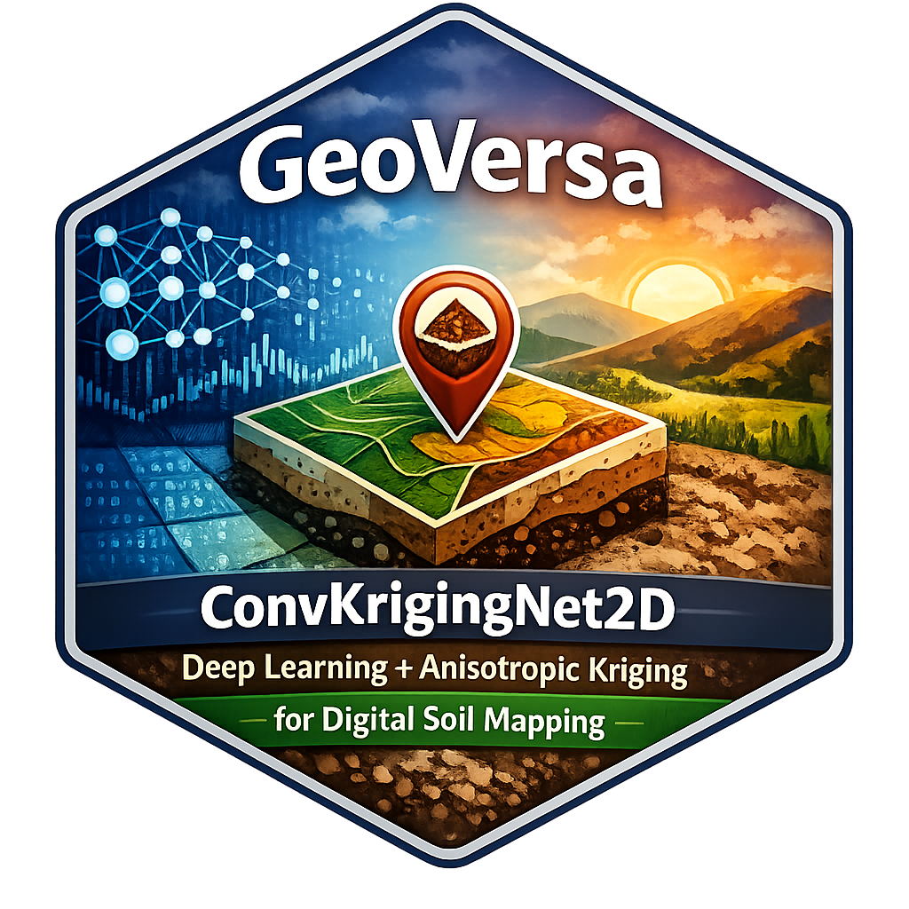

<p align="center">
  
</p>

<h1 align="center">GeoVersa</h1>

<p align="center"><em>Deep Learning + Geostatistics for Spatial Prediction</em></p>

<p align="center">
  <a href="https://doi.org/10.5281/zenodo.15139517"></a>
  <a href="https://cran.r-project.org/package=GeoVersa"></a>
  <a href="https://cran.r-project.org/package=GeoVersa"></a>
  <a href="https://cran.r-project.org/"></a>
  <a href="https://torch.mlverse.org/"></a>
  <a href="https://github.com/HugoMachadoRodrigues/GeoVersa"></a>
  <a href="LICENSE"></a>
  <a href="https://www.pedometrics.org/"></a>
</p>

<p align="center">
  <a href="https://orcid.org/0000-0002-8070-8126"></a>
  <a href="https://scholar.google.com/citations?user=vu-Ka7wAAAAJ&sortby=pubdate"></a>
  <a href="https://www.researchgate.net/profile/Hugo-Rodrigues-12"></a>
  <a href="https://twitter.com/Hugo_MRodrigues"></a>
</p>

---

## What is GeoVersa?

**GeoVersa** is a pedometric research package that combines deep learning and geostatistics in a single trainable architecture for spatial prediction in Digital Soil Mapping (DSM).

The current implementation is centered on **ConvKrigingNet2D**, a point-wise predictor with four coupled components:

| Component | Input | Role |
|---|---|---|
| Tabular encoder | Point-level covariates | Learns the non-linear trend from SCORPAN-style attributes |
| Patch encoder | Local raster patch around the sample | Learns spatial texture from terrain and remote-sensing context |
| Coordinate encoder | Geographic coordinates | Encodes position explicitly in latent space |
| Residual kriging layer | Nearby residual bank | Applies differentiable anisotropic spatial correction |

The trend model and the residual spatial correction are trained jointly. The benchmarked configuration is the **pure GeoVersa** variant: `RF distillation` is disabled.

At a high level, GeoVersa learns a base predictor and then adds a spatially weighted residual correction:

```math
\hat{y}_i^{(s)} = \hat{y}_{i}^{\mathrm{base}} + \beta\,\delta_i
```

where $\hat{y}_i^{(s)}$ is the prediction in standardized target space, $\hat{y}_{i}^{\mathrm{base}}$ is the deep trend prediction, $\delta_i$ is the learned residual-kriging correction, and $\beta \in (0,1)$ is a learned global gate.

---

## Automatic Configuration

**GeoVersa** uses data-driven automatic configuration. The user provides the data and the compute device; the training pipeline derives the main hyperparameters from sample size, patch geometry, variogram structure, gradient statistics, and available memory.

| Hyperparameter | Derived from |
|---|---|
| Kriging range (ℓ_maj, ℓ_min), anisotropy angle (θ) | Empirical variogram fitted to training targets |
| Neighbour count K | Training-point density and variogram practical range |
| Network width d, patch embedding dim | √n scaling plus patch geometry |
| Dropout rates | Sample size (larger n → less regularisation needed) |
| Learning rate | Gradient norm statistics (short probe pass) |
| Batch size | Available GPU/MPS/CPU memory |
| Early stopping patience | Loss trajectory during warmup phase |
| Coordinate embedding dimension | Variogram anisotropy and nugget ratio |
| Weight decay | Model parameter count |

This automatic configuration is split into three stages:

1. **Variogram stage**: initialize anisotropy, neighbour count, and the kriging gate from the empirical spatial structure.
2. **Capacity stage**: size the latent space and regularization from sample size and patch geometry.
3. **Optimization stage**: infer learning rate, batch size, patience, and refresh cadence from gradients, hardware, and warmup behavior.

The current code path derives the training configuration automatically from the data and the available hardware.

---

## Mathematical Formulation

For a sample observed at location $s_i \in \mathbb{R}^2$, GeoVersa uses the following notation:

| Symbol | Meaning |
|---|---|
| $x_i \in \mathbb{R}^p$ | Tabular covariates |
| $P_i \in \mathbb{R}^{C \times H \times W}$ | Raster patch centered at $s_i$ |
| $y_i$ | Observed target |
| $T(y_i)$ | Optional target transformation |
| $y_i^{(s)} = \dfrac{T(y_i) - \mu_y}{\sigma_y}$ | Standardized target used in training |

### Forward Model

GeoVersa computes three latent embeddings:

```math
\begin{aligned}
e_i^{\mathrm{tab}}   &= f_{\mathrm{tab}}(x_i) \in \mathbb{R}^d \\
e_i^{\mathrm{patch}} &= W_{\mathrm{patch}}\,f_{\mathrm{cnn}}(P_i) \in \mathbb{R}^d \\
e_i^{\mathrm{coord}} &= W_{\mathrm{coord}}\,f_{\mathrm{coord}}(s_i) \in \mathbb{R}^d
\end{aligned}
```

These embeddings are fused into a shared latent representation and mapped to a base prediction:

```math
\begin{aligned}
z_i &= f_{\mathrm{fuse}}\!\left([e_i^{\mathrm{tab}}, e_i^{\mathrm{patch}}, e_i^{\mathrm{coord}}]\right) \\
\hat{y}_i^{\mathrm{base}} &= h(z_i)
\end{aligned}
```

The latent width $d$, patch embedding dimension, coordinate embedding dimension, and dropout rates are all derived automatically in the current implementation.

### Residual Memory Bank

At each memory-bank refresh, the current backbone is applied to the training set to build a residual bank:

```math
\mathcal{B} = \{(z_j, s_j, r_j)\}_{j=1}^{n_{\mathrm{train}}},
\qquad
r_j = y_j^{(s)} - \hat{y}_j^{\mathrm{base}}
```

The kriging branch therefore interpolates **learned residuals**, not raw targets, and it does so in standardized target space.

### Anisotropic Residual Kriging

For a query point $i$ and a neighbour $j$, define the rotated anisotropic coordinates:

```math
\begin{aligned}
\Delta x_{ij} &= x_i - x_j, \qquad \Delta y_{ij} = y_i - y_j \\
u_{ij} &= \cos(\theta)\,\Delta x_{ij} + \sin(\theta)\,\Delta y_{ij} \\
v_{ij} &= -\sin(\theta)\,\Delta x_{ij} + \cos(\theta)\,\Delta y_{ij} \\
d_{ij}^{\mathrm{aniso}} &= \sqrt{\left(\frac{u_{ij}}{\ell_{\mathrm{maj}}}\right)^2 + \left(\frac{v_{ij}}{\ell_{\mathrm{min}}}\right)^2 + \varepsilon}
\end{aligned}
```

GeoVersa combines this anisotropic distance with latent similarity:

```math
\begin{aligned}
q_i &= W_q z_i,\qquad q_j = W_q z_j \\
s_{ij} &= \frac{\langle q_i, q_j \rangle}{\sqrt{d_q}} \\
w_{ij} &= \frac{\exp\!\left(-d_{ij}^{\mathrm{aniso}} + s_{ij}\right)}{\sum_{k \in \mathcal{N}(i)} \exp\!\left(-d_{ik}^{\mathrm{aniso}} + s_{ik}\right)} \\
\delta_i &= \sum_{j \in \mathcal{N}(i)} w_{ij} r_j
\end{aligned}
```

So the spatial correction is an **attention-weighted residual interpolation** constrained by anisotropic distance.

### Final Predictor

The current benchmark uses a learned global kriging gate:

```math
\beta = \sigma(\mathrm{logit}_\beta),
\qquad
\hat{y}_i^{(s)} = \hat{y}_i^{\mathrm{base}} + \beta\,\delta_i
```

The prediction returned to the user is then mapped back to the original target scale by undoing the standardization and any optional target transform.

> **Implementation note**: the core model code supports an optional eval-time distance gate and kriging dropout. In the current pure benchmark path, those mechanisms are not the main formulation being used.

### Training Objective

The warmup phase trains only the backbone:

```math
\mathcal{L}_{\mathrm{warmup}} = \mathrm{Huber}\!\left(y^{(s)}, \hat{y}^{\mathrm{base}}\right)
```

After warmup, the full model is trained with:

```math
\begin{aligned}
\mathcal{L} &=
\mathrm{Huber}\!\left(y^{(s)}, \hat{y}^{(s)}\right)
 + \lambda_{\mathrm{base}}\,\mathrm{Huber}\!\left(y^{(s)}, \hat{y}^{\mathrm{base}}\right) \\
&\quad + \alpha_{\mathrm{ME}}\left(\mathrm{mean}(\hat{y}^{\mathrm{base}}) - \mathrm{mean}(y^{(s)})\right)^2 \\
&\quad + \lambda_{\mathrm{cov}}\left(\frac{\mathrm{sd}(\hat{y}^{\mathrm{base}})}{\mathrm{sd}(y^{(s)}) + \varepsilon} - 1\right)^2
\end{aligned}
```

where $\lambda_{\mathrm{base}}$ is the base-loss weight, $\alpha_{\mathrm{ME}}$ penalizes bias in the base predictor mean, and $\lambda_{\mathrm{cov}}$ matches the scale of the base predictor to the scale of the target.

For the current pure benchmark:

- `RF distillation` is removed, so `λ_RF = 0`
- the residual bank is refreshed periodically during training from the current backbone state
- early stopping and LR reduction are driven by validation loss

### What GeoVersa Auto-Configures

The current implementation derives the key parameters using explicit heuristics tied to the data and the fitted variogram:

```math
\begin{aligned}
K &= \mathrm{clamp}\!\left(\mathrm{round}\!\left(\frac{n_{\mathrm{train}}\,\pi\,\ell_{\mathrm{maj}}^2}{\mathrm{area}}\right), 6, 30\right) \\
\mathrm{logit}_{\beta,0} &= 2 - 6r \\
d &= \mathrm{clamp}\!\left(64\,\left\lceil \frac{\sqrt{n_{\mathrm{train}}}}{8} \right\rceil, 128, 512\right) \\
\mathrm{patch\_size} &= \mathrm{clamp}\!\left(\left\lfloor \sqrt{n_{\mathrm{train}}} \right\rfloor, 8, 31\right) \\
\mathrm{patch\_dim} &= \mathrm{clamp}\!\left(\left\lceil \sqrt{C H W} \right\rceil, \frac{d}{4}, d\right) \\
\mathrm{coord\_dim} &= \mathrm{clamp}\!\left(32 + 24(1 - \rho_{\mathrm{aniso}}) + 8(1 - r), 32, 64\right)
\end{aligned}
```

with $r$ denoting the nugget-to-sill ratio and $\rho_{\mathrm{aniso}} = \ell_{\mathrm{min}} / \ell_{\mathrm{maj}}$.

The loss weights are also variogram-derived:

```math
\lambda_{\mathrm{base}} = 0.10\,r,
\qquad
\alpha_{\mathrm{ME}} = 0.75\,r,
\qquad
\lambda_{\mathrm{cov}} = 0.025(1-r)
```

The initial learning rate is estimated from a Polyak-style probe on the actual model:

```math
\alpha_{\mathrm{Polyak}} = \frac{\mathcal{L}}{\lVert \nabla \mathcal{L} \rVert_2^2},
\qquad
\alpha_{\mathrm{init}} = \mathrm{clamp}\!\left(0.01\,\alpha_{\mathrm{Polyak}}, 10^{-5}, 10^{-3}\right)
```

Batch size is the minimum of:

- a **statistical** target of roughly `n/8` samples per batch
- a **hardware** limit estimated from available memory and per-sample tensor cost

Weight decay scales with parameter count:

```math
\mathrm{wd} = \mathrm{clamp}\!\left(\frac{10^{-3}}{\sqrt{(n_{\mathrm{params}}/10^6)/5}}, 10^{-4}, 10^{-2}\right)
```

Warmup validation losses then determine:

- LR patience
- early-stopping patience
- LR decay factor
- memory-bank refresh interval

---

## From SCORPAN to DeepSCORPAN

GeoVersa implements the **SCORPAN** framework (McBratney et al., 2003) as a unified neural network. Each soil-forming factor maps to a specialised encoder:

| SCORPAN Factor | Encoder |
|---|---|
| S, C, O, R, P, A (point-level covariates) | Tabular MLP |
| O, R (spatial texture as raster) | 2D CNN PatchEncoder |
| N (geographic position) | Coordinate MLP |
| ε(s) (spatially structured residual) | Differentiable anisotropic residual-kriging layer |

Classical regression-kriging fits these components in separate stages. **DeepSCORPAN trains all of them jointly**, so the trend model is aware of spatial autocorrelation and the kriging layer is aware of covariate structure.

| Aspect | Regression-Kriging | Random Forest | **GeoVersa** |
|---|:---:|:---:|:---:|
| SCORPAN covariates | ✅ linear | ✅ non-linear | ✅ deep non-linear |
| Local raster texture | ❌ | ❌ | ✅ 2D CNN patch |
| Spatial autocorrelation | ✅ fitted variogram | ❌ | ✅ learned residual interpolation |
| Anisotropy | ⚠️ manual | ❌ | ✅ learned θ, ℓ_maj, ℓ_min |
| Joint trend + residual training | ❌ two-stage | ❌ | ✅ end-to-end |
| Zero hyperparameter tuning | ❌ | ❌ | ✅ fully automatic |

---

## Current Benchmark Status

The benchmark runner follows the **Wadoux et al. (2021)** validation framework. In this repository, that means:

- using the same benchmark dataset and protocol family
- treating **Design-Based** validation as the main map-accuracy estimate
- comparing models trained locally under the same runner

The current clean run is:

- model: **GeoVersa / ConvKrigingNet2D**, pure version (`RF distillation` removed)
- baseline: **local RF**, trained on the same sampled calibration sets
- scenario: `random`
- calibration sample size: `n = 500`
- iterations completed: `3`
- verified protocol so far: **DesignBased**

| Model | ME | RMSE | Spearman² | MEC |
|---|:---:|:---:|:---:|:---:|
| RF (local benchmark) | 0.42 | 31.74 | 0.803 | 0.883 |
| GeoVersa (pure) | -0.02 | 35.08 | 0.763 | 0.853 |

At this point, **GeoVersa pure does not outperform the local RF baseline** on the clean Design-Based benchmark.

Source: clean Design-Based benchmark summary generated by this repository under `results/`.

In this benchmark runner, `R²` is the squared **Spearman** correlation, matching the Wadoux-style metric implementation in the repository.

> **Important**: this README no longer reproduces hardcoded numeric summaries attributed to the Wadoux paper. The paper is used here as the **validation-framework reference**; benchmark numbers shown in this README are only the numbers generated by this repository.

`RandomKFold` and `SpatialKFold` remain implemented in the runner, but the clean post-distillation benchmark above was validated only for `DesignBased`.

---

## How to Run

### Requirements

```r
install.packages(c("torch", "ranger", "dplyr", "terra", "sf", "FNN", "caret"))
torch::install_torch()  # one-time setup
```

### Clone

```bash
git clone https://github.com/HugoMachadoRodrigues/GeoVersa.git
cd GeoVersa
```

### Reproduce the benchmark

```r
# Open GeoVersa.Rproj in RStudio, then:
Sys.setenv(
  WADOUX_MODELS      = "RF,ConvKrigingNet2D",
  WADOUX_PROTOCOLS   = "DesignBased,RandomKFold,SpatialKFold",
  WADOUX_N_ITER      = "50",
  WADOUX_SAMPLE_SIZE = "500",
  WADOUX_DEVICE      = "mps",
  WADOUX_RESULTS_DIR = "results/wadoux2021_auto_50iter"
)
source("code/run_wadoux_style_rf_conv_comparison.R")
```

Runs 50 independent iterations of the Wadoux (2021) benchmark with full automatic configuration.
Results saved to `results/wadoux2021_auto_50iter/`.

### Custom run

```r
Sys.setenv(
  WADOUX_MODELS         = "RF,ConvKrigingNet2D",
  WADOUX_PROTOCOLS      = "DesignBased,RandomKFold,SpatialKFold",
  WADOUX_N_ITER         = "50",        # independent iterations
  WADOUX_SAMPLE_SIZE    = "500",
  WADOUX_DEVICE         = "mps",       # "cuda", "mps", or "cpu"
  WADOUX_RESULTS_DIR    = "results/my_run"
)
source("code/run_wadoux_style_rf_conv_comparison.R")
```

---

## Project Structure

```
GeoVersa/
├── code/
│   ├── ConvKrigingNet2D.R                    # Core model architecture (sources utilities below)
│   ├── ConvKrigingNet2D_Auto.R               # Training loop and automatic configuration hooks
│   ├── auto-configuration scripts            # Data-driven parameter derivation utilities
│   ├── benchmark entry scripts               # High-level benchmark launchers
│   ├── run_wadoux_style_rf_conv_comparison.R # Benchmark engine
│   ├── wadoux2021_rf_reproduction_helpers.R  # Data loading, protocols, Wadoux metrics
│   ├── KrigingNet_PointPatchCNN.R            # Patch extraction + memory bank utilities
│   ├── KrigingNet_DualFramework.R            # Context loaders (sim + Wadoux)
│   ├── KrigingNet_WadouxComparison.R         # Foundational utilities (MLP, scalers, losses)
│   ├── figures_wadoux_comparison.R           # Figures from local Wadoux-style benchmark runs
│   ├── figures_paper.R                       # Manuscript figures (requires comparable baseline runs)
│   └── generate_wadoux_maps.R                # Prediction maps
├── external/SpatialValidation/               # Wadoux et al. (2021) original data
├── data/                                     # Local data (gitignored)
├── logo/                                     # GeoVersa visual identity assets
├── results/                                  # Output metrics (gitignored)
├── figures/                                  # Generated figures
└── README.md
```

> **Note on dependency chain**: `ConvKrigingNet2D.R` sources `KrigingNet_PointPatchCNN.R`, which sources `KrigingNet_DualFramework.R`, which sources `KrigingNet_WadouxComparison.R`. All three utility files are required for the model to load. The `load_convkrigingnet2d_env()` runner function handles this chain automatically.

---

## References

- **Wadoux, A.M.J.-C., Heuvelink, G.B.M., de Bruin, S., Brus, D.J.** (2021). Spatial cross-validation is not the right way to evaluate map accuracy. *Ecological Modelling*, 457, 109692. [doi:10.1016/j.ecolmodel.2021.109692](https://doi.org/10.1016/j.ecolmodel.2021.109692)
- **McBratney, A.B., Mendonça Santos, M.L., Minasny, B.** (2003). On digital soil mapping. *Geoderma*, 117(1–2), 3–52. [doi:10.1016/S0016-7061(03)00223-4](https://doi.org/10.1016/S0016-7061(03)00223-4)
- **Matheron, G.** (1963). Principles of geostatistics. *Economic Geology*, 58(8), 1246–1266.
- **He, K., Zhang, X., Ren, S., Sun, J.** (2016). Deep residual learning for image recognition. *CVPR 2016*.

---

## Citation

```bibtex
@software{GeoVersa,
  author = {Rodrigues, Hugo},
  title  = {{GeoVersa}: Deep Learning + Geostatistics for Spatial Prediction},
  year   = {2026},
  doi    = {10.5281/zenodo.15139517},
  url    = {https://github.com/HugoMachadoRodrigues/GeoVersa}
}
```

---

<div align="center">

**Built for the Pedometrics community**

*GeoVersa — where deep learning meets geostatistics*

</div>
